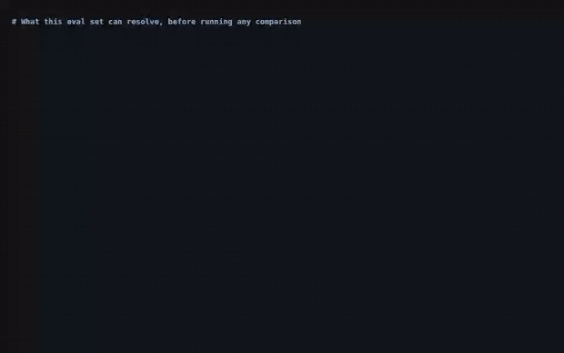
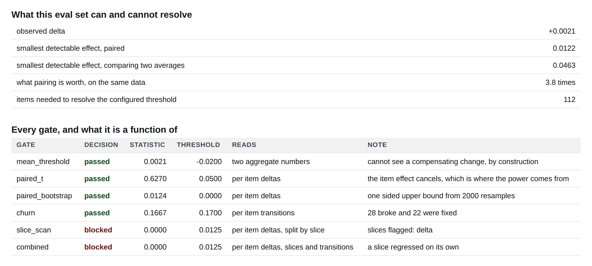
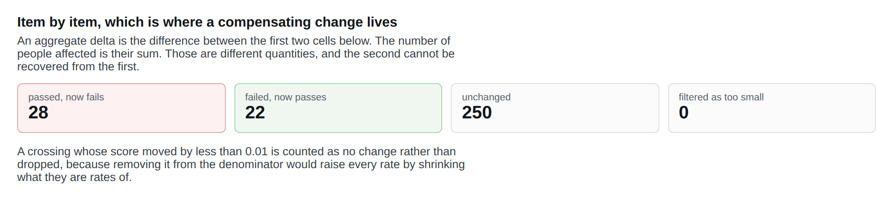
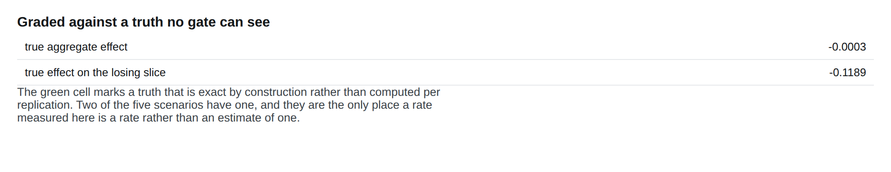
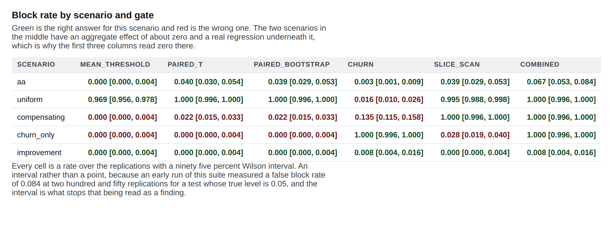
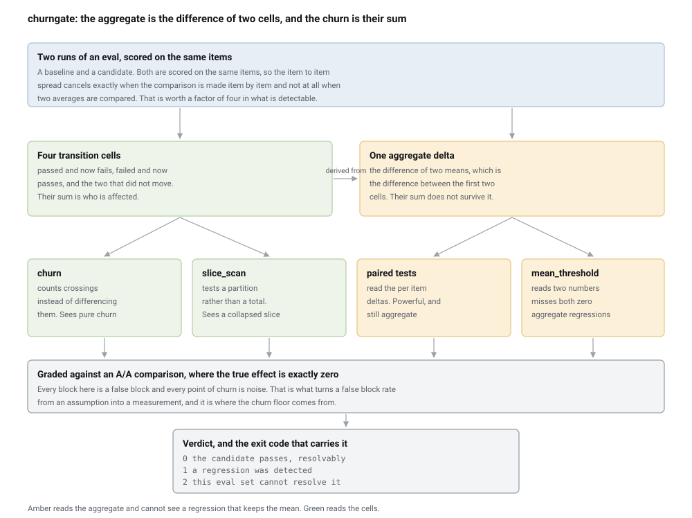
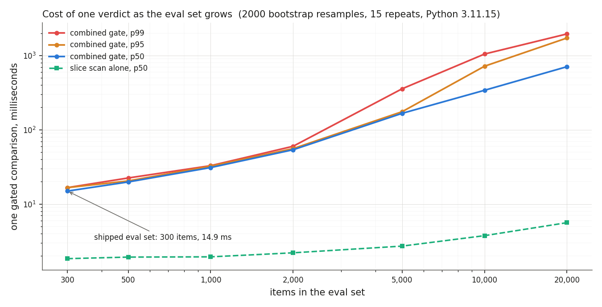

# eval-churn-gate

**A regression gate for model evaluations that blocks a release when one slice collapses while the average holds, refuses to call a difference it cannot resolve a pass, and publishes its own false block rate so a green tick means something.**

[](https://github.com/srujan20/eval-churn-gate/actions/workflows/ci.yml)
[](#tests-coverage-and-receipts)
[](#tests-coverage-and-receipts)
[](#every-number-here-is-checked-by-ci)
[](#the-three-verdicts-on-real-runs)
[](LICENSE)

## What this solves

- **A release keeps its average score and ruins one slice, and the gate passes it.** In the scenario built for this, a slice loses 0.1173 while the aggregate moves by 0.0006 in the median case. The threshold on the mean sees it 0.0 of the time. The slice scan catches it 1.0 of the time, and the difference is not cleverness: one gate reads two numbers and the other reads the partition those two numbers were computed from.
- **Nobody knows their gate's false block rate, because nobody scores a release against itself.** This one is graded on 1000 comparisons whose true effect is exactly zero by construction. It blocked 0.069 of them and passed only 0.003. Every rate in this repository carries a Wilson interval, because an early measurement of one of these rates was wrong for an hour and looked like a finding.
- **"Pass" and "I cannot tell" are the same exit code in almost every gate that ships.** At the shipped eval set of 300 items the smallest regression this data can detect is 0.0122 paired, against 0.0463 when two averages are compared. Anything below that is unresolvable, and this gate exits 2 and says so instead of exiting 0 and being read as evidence.

## Executive summary

An eval regression gate is usually a threshold on one summary number, and one summary number cannot distinguish "nothing changed" from "one group got much worse and another got better by the same amount". The count of items whose outcome changed is a function of the *sum* of the two transition counts, and the difference of means is a function of their *difference*, so the second is not a hard question for an aggregate gate, it is outside what that gate is a function of. This repository builds a corpus where the true effect is known, including comparisons of a version against itself where the true effect is exactly zero rather than approximately zero, and measures what each gate actually does. Across the regression scenarios, the gate almost every pipeline ships **catches 0.323 of** them, and misses both of the two whose aggregate is about zero. On a product decision that is two releases in three shipping with a green tick beside a regression, and the cost lands on whichever slice of users the change happened to hurt. The share of users affected is an assumption this repository cannot make for you; every other number in this paragraph is measured and re-measured in CI.

`churngate` turns that into a build status with three outcomes rather than two. It reads per item scores from two runs, computes the four transition cells before it computes any average, runs five gates plus a combination of them, and returns one of three verdicts: a regression was detected, the candidate passes, or this eval set cannot resolve a difference this small. The combined gate **catches 1.0, at a false block rate of 0.037**, and that cost is printed rather than hidden: the paired interval alone blocks 0.039 of clean releases, and the extra conditions are what buy the two scenarios it misses. The uncomfortable number is the third verdict. On comparisons whose true effect is exactly zero, this tool answers "the eval set cannot resolve a difference this small" 0.928 of the time the honest answer is exactly that, and a gate with only pass and fail returns pass for all of them.

Over 1000 comparisons whose true effect is exactly zero, run to run variation alone flips 0.1167 of items across the pass boundary, with a ninety fifth percentile of 0.1467, and 0.8889 of that movement is cancelled by the net. That is the number that made the design: one item in nine changes side while the average reports approximately nothing. 207 tests, 99.3 percent line coverage, over 5000 gated comparisons, and `make verify` re-measures every figure quoted in this document, in the defense guide, in the policy file and in five decision records, and fails if any of them has moved.

## Watch it work (30 seconds)



Every line of terminal text above is real captured stdout from a command that ran, with each segment paced by that command's measured wall time. It is a replay of a captured session rather than a live screen recording, and [`docs/video/manifest.json`](docs/video/manifest.json) lists each command with its exit code and measured duration. Higher quality MP4: [`docs/video/demo.mp4`](docs/video/demo.mp4).

## The three verdicts on real runs

**A collapsed slice, blocked. Exit code 1.** The compensating scenario drops one slice and lifts the others just enough to pay for it. The mean moves by less than the eval set can resolve, the slice scan fires, and the report puts the transitions above the aggregate on purpose, because the aggregate is a summary of them and not a separate fact.



```
$ python -m churngate gate --scenario compensating
verdict: regression-detected
scenario: compensating  items: 300

what moved, item by item
  passed and now fails : 28
  failed and now passes: 22
  unchanged            : 250
  gross flips 50 (0.1667), net -6 (-0.0200)
  share of the movement the net cancels away: 0.8800

the aggregate, which is a summary of the above and not a separate fact
  observed delta: +0.0021
  this delta is below what 300 items can resolve. 112 items would be needed

what each gate decided, and what it reads
  gate                blocked   statistic   threshold  reads
  mean_threshold        False      0.0021     -0.0200  two aggregate numbers
  paired_bootstrap      False      0.0124      0.0000  per item deltas
  churn                 False      0.1667      0.1700  per item transitions
  slice_scan             True      0.0000      0.0125  per item deltas, split by slice
$ echo $?
1
```

**The same comparison, as the gate almost everyone ships sees it.** Five of the six rows above say False. That is the finding, not a bug: three of those gates are functions of two numbers, and the thing that changed is not visible in two numbers.



**A difference the gate refuses to call anything. Exit code 2.** Scored against itself, the tool reports `eval-set-cannot-resolve-this` rather than a pass. Exit 2 is a distinct code from exit 0 for one reason: a gate that returns the same code for "the candidate passes" and "I could not tell" has a green tick that means nothing, and that is the most common way a regression reaches production with a pass beside it.



**Every gate on every scenario, with an interval on every rate.** The top row is the comparison whose true effect is exactly zero, which is what makes every block in it a false block rather than an estimate of one.



[`docs/screenshots/manifest.json`](docs/screenshots/manifest.json) records which report each image came from and the measured contrast ratio of the verdict badge in it. The capture script fails the run if a badge is invisible or falls below a contrast ratio of 4.5, because the screenshot tool is the only thing in this pipeline that can see pixels.

## Architecture



<details>
<summary>the diagram source, and why this is a committed image</summary>

There is no mermaid fence here, and that is a decision rather than an omission. GitHub renders mermaid itself, and when it works the source is the picture, which is the better arrangement. It does not always work: a diagram that parses under mermaid versions ten and eleven locally can still come back from GitHub as "Unable to render rich display", which is a failure inside their renderer that nothing in this repository can fix. Three smaller traps pushed the same way. A diagram with HTML labels is not well formed XML, because the labels sit in a `foreignObject` with unclosed `br` tags, and it then displays when injected into a live page and fails silently as an `img src`, with `naturalWidth` 0 and nothing in any console. An `img src` with a percentage width and no intrinsic height leaves the browser without an aspect ratio. And a transparent background is not theme neutral, because light node fills with dark text come out as dark grey on near black in a dark theme.

So `tools/render_diagram.py` emits the SVG by hand, with `text` and `tspan` only, intrinsic dimensions, and one opaque rectangle covering the whole viewBox. It renders identically on GitHub, in an editor preview, in the PDF and offline. The layout it draws, which is the source in the sense that matters:

```diagram-source name=architecture
two runs, scored on the same items
  baseline: per item scores, slice labels, item ids
  candidate: per item scores, slice labels, item ids

  the pairing check runs first and refuses rather than averaging:
  two runs scored on different item sets cannot be compared item by item

reduction one, the transitions        reduction two, the aggregate
  passed and now fails                  mean of the candidate
  failed and now passes                 minus mean of the baseline
  unchanged, both sides                 one number
  gross flips = the sum
  net = the difference

gates drawn under what each one reads
  reads two numbers only        reads per item detail
    mean_threshold                paired_t
                                  paired_bootstrap
                                  churn        (transitions)
                                  slice_scan   (deltas, split by slice)
                                  combined     (all three)

verdict, one of three
  regression-detected              exit 1
  passes                           exit 0
  eval-set-cannot-resolve-this     exit 2
```

Regenerating the image after editing that layout is one command: `python tools/render_diagram.py`.

</details>

The dividing line is the whole design. Everything on the left of the diagram reads two numbers. Everything on the right reads the per item detail those two numbers were computed from, and the arrows are drawn so that each gate sits under the box it is a function of. An earlier version of this diagram put the gates in the order the README discusses them, and every arrow crossed.

## What the measurement told me to throw away

This is the section I would most want reviewed, because it is the tool reporting on its own author's first four choices.

**Rejected: a threshold on the aggregate, which is what I would have shipped.** It is the gate almost every pipeline has, it is one line of code, and measured against a known truth it catches 0.323 of the regressions in this corpus and sees neither of the two whose aggregate is about zero. It is not a weak gate, it is a gate answering a different question from the one it is asked. It stays in the repository as a named gate rather than being deleted, because the comparison against it is the point of the whole exercise, and because it is the baseline anybody adopting this tool is currently running.

**Rejected: a threshold set at the size of the regression it is meant to catch.** This felt like the obviously correct way to configure a gate, and it is a coin flip. When the true effect equals the threshold, the observed value lands either side of it with roughly equal probability, so the gate **catches it 0.455 of the time it happens**, against 0.99 for the paired interval on the same data.

| True drop | Mean threshold | Paired bootstrap |
| --- | --- | --- |
| 0.000 | 0.0 | 0.055 |
| 0.005 | 0.0 | 0.28 |
| 0.010 | 0.018 | 0.617 |
| 0.020 | 0.455 | 0.99 |
| 0.030 | 0.973 | 1.0 |
| 0.050 | 1.0 | 1.0 |
| 0.080 | 1.0 | 1.0 |

Reading down the first column shows the other half of the problem: a gate that is nearly blind below its threshold and nearly certain above it, which is not the shape in which a regression arrives.

**Rejected: the slice scan on its own, once it turned out to be the hero of claim one.** It catches the collapsed slice 1.0 of the time, so the temptation is to ship only that. It catches only 0.028 of it when the scenario is pure churn, where the same number of items move in both directions and no slice is worse on average. The churn gate catches that one 1.0. Two blind spots, two gates, and neither of them is the aggregate.

| Gate | Sees the collapsed slice | Sees pure churn | False blocks on A/A |
| --- | --- | --- | --- |
| mean_threshold | 0.0 | 0.0 | 0.0 |
| paired_t | 0.022 | 0.0 | 0.04 |
| paired_bootstrap | 0.022 | 0.0 | 0.039 |
| churn | 0.135 | 1.0 | 0.003 |
| slice_scan | 1.0 | 0.028 | 0.039 |
| combined | 1.0 | 1.0 | 0.067 |

The three aggregate gates fire on the collapsed slice at or below their own false block rate on A/A, which means they are not detecting it. They are firing at their own noise rate. The churn gate is the interesting near miss: it counts crossings rather than differencing them, so in principle it can see compensating movement, and on a slice losing a tenth of a point it manages 0.135, because too few items cross the boundary to clear the noise floor its own threshold has to sit above.

**Kept: the combination, with its price printed next to it.** Which gate to ship depends on which mistake costs more, and that is a property of a team rather than of a method, so this ends in a table rather than a recommendation.

| Gate | Catches a real regression | Blocks a clean release |
| --- | --- | --- |
| mean_threshold | 0.323 | 0.0 |
| paired_t | 0.341 | 0.02 |
| paired_bootstrap | 0.341 | 0.019 |
| churn | 0.384 | 0.005 |
| slice_scan | 0.674 | 0.019 |
| combined | 1.0 | 0.037 |

If shipping a regression is the expensive mistake, the combined gate is the answer. If blocking a good release is, the churn gate **catches 0.384 overall** while **blocking only 0.005**. The mean threshold gate blocked nothing at all across the clean scenarios, which supports a claim of below 0.05 percent and nothing stronger over 2000 clean releases, and it is still the wrong choice because of what it misses. Reproduce with `python experiments/exp05_what_the_combined_gate_costs.py`.

## Method: what each gate is a function of

A gate that is a function of two numbers cannot answer a question about the distribution those two numbers came from, however good its statistics are. That is mechanical rather than arguable, so the table is mechanical too.

| Gate | Reads | May therefore claim | May not claim |
| --- | --- | --- | --- |
| `mean_threshold` | two aggregate numbers | the average moved by more than a fixed tolerance | anything about which items moved, or how many |
| `paired_t` | per item deltas | the mean delta is distinguishable from zero, assuming approximate normality | anything about a subgroup, or about items that cancelled |
| `paired_bootstrap` | per item deltas | the same, without the normality assumption | the same |
| `churn` | per item transitions | the share of items that changed side exceeds the measured noise floor | which direction the aggregate went, since it is a sum and not a difference |
| `slice_scan` | per item deltas, split by slice | one named slice moved, with a Holm corrected family of tests | anything about a subgroup that carries no label |
| `combined` | all three | either a slice moved, or the aggregate moved, or the churn cleared the floor | that its false block rate is the smallest of the set, because it is not |

The A/A comparison is what makes any of these a measurement rather than an estimate. A version scored against itself has a true effect of exactly zero by construction, so every block is a false block and every point of churn is noise, with no modelling assumption in between. Two of the five scenarios have a true effect that is exact in this sense, and the row type records which, because averaging an exact quantity together with an estimated one and reporting the result as one kind of number is a mistake that does not announce itself. ADR-002 has the reasoning.

### What this eval set can resolve, before any comparison is run

Both runs are scored on the same items, so the item to item spread cancels exactly when the comparison is made item by item and not at all when two averages are compared.

| Items | Paired | Two averages |
| --- | --- | --- |
| 100 | 0.0211 | 0.0802 |
| 300 | 0.0122 | 0.0463 |
| 1000 | 0.0067 | 0.0254 |
| 3000 | 0.0039 | 0.0146 |
| 10000 | 0.0021 | 0.008 |

At the shipped 300 item eval set the smallest detectable regression **is 0.0122 paired**, **against 0.0463 when** two averages are compared. That is **worth a factor of 3.8** on the same data, and it costs nothing but keeping the per item scores, which most pipelines already have and then average away before writing them down. Detecting the configured threshold **needs 112 items paired**, **or 1608 comparing two** averages. Two arithmetic checks that the noise model does what it claims: an observed **standard deviation of 0.0046** for the aggregate delta against the **predicted 0.0049 from** the noise parameters alone.

The strongest form of the impossibility, as a number rather than an argument: across **2133 comparisons whose delta** is within five thousandths of zero, the share of items that changed side runs **from 0.0667 to** 0.5933 **of items**, with a **rank correlation of 0.001 in magnitude** between the delta and the churn and **a p value of 0.963**. Restricted to the **2000 comparisons whose true aggregate** effect is exactly zero, the **correlation there is 0.0027 in magnitude**. No function of the aggregate, monotone or otherwise, can bound the churn, and a dashboard showing the delta reports the same number at both ends of that range. Reproduce with `python experiments/exp04_the_aggregate_carries_no_churn_information.py`.

## Tech stack

| Technology | Role in this project | Why chosen here |
| --- | --- | --- |
| Python 3.11, 3.12, 3.13 | the whole tool | it runs as a step in someone else's CI after one `pip install`, which rules out anything heavier, and the suite runs on all three because it asserts properties rather than values |
| numpy | the score matrices and the bootstrap resampling | the paired bootstrap is one fancy indexing operation on a resamples by items matrix, so a thousand replications finish in a minute instead of an afternoon |
| scipy.stats | the t test, the normal quantiles, Spearman | the power arithmetic is written out in `gates.py` rather than imported, and only the distribution functions come from here, so the arithmetic can be checked by hand |
| PyYAML | the policy file | thresholds are the subject of this repository, so they cannot live in code where a reader has to trust a diff to find them |
| pytest, pytest-cov | 207 tests, 99.3 percent line coverage | the A/A anchor is a test as well as an experiment, so a change that breaks the zero effect construction fails the suite rather than quietly moving every published rate |
| ruff | lint and format, on `src`, `tests`, `tools`, `experiments` and `benchmark` | one tool, one config, and no argument about style in review |
| GitHub Actions | three Pythons, then a separate pinned receipts job | the tests run against whatever resolves because they assert properties; the published rates are re-measured with exact pins, because a rate over 5000 gated comparisons is worth nothing if it moves with a minor version bump |
| GitHub Actions composite action | distribution | `action.yml` makes this five lines in another repository, which is the difference between a demo and a tool |
| Playwright with Chromium | the report screenshots in `tools/` | the only way to check that a verdict badge is legible is to look at the pixels, and the capture asserts a contrast ratio before it saves |
| ffmpeg | the replay video | paced by measured wall time from a captured session, so the video cannot drift from the behaviour |
| matplotlib | the latency chart, in the evidence extra | drawn from `benchmark/results/gate_latency.json` and never by hand, so the chart and the table below it cannot disagree |
| cmark-gfm with Chromium | the defense guide PDF | one markdown source, two renderings, no second copy of the text to keep in step |

No optional runtime dependencies at all. ADR-004 explains that this was a constraint rather than an accident: a gate that a team has to install a machine learning stack to run is a gate that does not get installed.

## Quickstart

Prerequisites: Python 3.11, 3.12 or 3.13, and `git`. No API keys, no model weights, no network access at runtime, and nothing to download beyond three pure dependencies.

```bash
git clone https://github.com/srujan20/eval-churn-gate.git
cd eval-churn-gate
python -m venv .venv && source .venv/bin/activate    # Windows: .venv\Scripts\activate
pip install -e ".[dev]"

python -m churngate power                            # what this eval set can resolve, before comparing anything
python -m churngate gate --scenario compensating     # a slice collapses, the aggregate holds, exit 1
python -m churngate gate --scenario aa               # scored against itself, exit 2, not exit 0
python -m churngate sweep --html report.html         # every gate on every scenario, interval on every rate
make verify                                          # lint, 207 tests, and every published figure re-measured
```

`make help` lists every target. Everything regenerates deterministically from a seed, so a figure in this document can be reproduced from a fresh clone rather than taken on trust.

To point it at your own evaluation, copy the policy file and put your own measured noise in it. The two numbers that matter are the run to run and item to item standard deviations, and the honest way to get them is to score one version twice:

```bash
cp configs/policy.yaml my-policy.yaml       # then edit noise.run_sd and noise.item_sd
python -m churngate power -c my-policy.yaml # what your eval set can resolve, at your noise level
python -m churngate sweep -c my-policy.yaml # your gates' false block rates, on your numbers
```

The flip rate limit is the one threshold that cannot be copied, because it has to sit above the churn your own noise produces on its own. The loader refuses a limit far below that and names the measured floor in the message, which is the fix for a bug described below.

In another repository, as a step:

```yaml
- uses: srujan20/eval-churn-gate@v1.0.0
  with:
    policy: configs/policy.yaml
    scenario: compensating
    undecidable-fails: "false"    # exit 2 warns rather than blocks, until you trust it
```

`action.yml` is a composite action, and the reason it exists rather than a bare `run:` line is the third exit code. Exit 1 is a detected regression and fails the step. Exit 2 means the eval set could not resolve the difference, which is neither a pass nor a regression, so the action lets the caller decide and defaults to a warning annotation: a team adopting this should watch that verdict for a fortnight before blocking on it. Exit 3 and 4 always fail, because they mean the gate did not run at all. The verdict and the raw exit code are both step outputs, and the full report is appended to the job summary either way.

## Performance under load

Method: `benchmark/bench_gate.py` times one call to `run_all`, which is every gate on one comparison, one comparison at a time rather than batched, because a single verdict on a single comparison is what a caller experiences. 15 timed repeats per size after one untimed warm up call, seven eval set sizes from the shipped 300 up to 20000 items, bootstrap resamples held at the shipped 2000 rather than scaled down at the large sizes. The comparison itself is built outside the timed region, because drawing three normal vectors is not work the gate does: in production the two score vectors arrive from a harness that already ran. Hardware: 2 vCPU, 7 GB RAM container, and the interpreter the benchmark recorded for itself, **Python 3.11.15**.



| items | p50 ms | p95 ms | p99 ms | slice scan alone, ms | bootstrap matrix, MB |
| --- | --- | --- | --- | --- | --- |
| 300 | 14.9 | 16.6 | 16.6 | 1.8 | 4.6 |
| 500 | 19.8 | 20.5 | 22.4 | 1.9 | 7.6 |
| 1000 | 31.0 | 32.4 | 32.8 | 1.9 | 15.3 |
| 2000 | 53.8 | 55.7 | 60.0 | 2.2 | 30.5 |
| 5000 | 166.5 | 175.2 | 356.5 | 2.7 | 76.3 |
| 10000 | 340.5 | 718.2 | 1047.7 | 3.8 | 152.6 |
| 20000 | 707.7 | 1723.1 | 1954.6 | 5.6 | 305.2 |

The shipped configuration **decides in 14.9 ms** at the median with a **p95 of 16.6 ms**, which is not a number anybody needs to optimise: it is a step in a pull request, not a request path. Measured **out to 20000 items** the median is **707.7 ms at the largest** size, **a linearity ratio of 0.71** across the range, which is slightly sublinear because fixed overheads dominate at the small end rather than because anything clever is happening.

Where it degrades, honestly: the tail widens, and it widens for a reason worth naming. The paired bootstrap is **0.479 of the total cost** at the largest size and it materialises a resamples by items matrix of float64, which **allocates 305.2 MB** at 20000 items. Up to 5000 items the distribution is tight, with p95 within a few percent of p50. Past that the allocator becomes the story: **p95 rises to 1723.1 ms** and **p99 is 2.76 times p50**, on a container with 7 GB of memory. That is an allocation profile rather than an arithmetic cost, and the fix if it ever mattered would be to resample in chunks rather than to build the matrix at once. It has not mattered, because the gate runs on eval sets three orders of magnitude smaller than the point where it starts.

The comparison in the chart is the one worth reading. At 20000 items the **slice scan costs 5.6 ms** on its own, which is **126 times cheaper than the total**, and it is the gate that catches the regression this whole repository is about. The **mean threshold gate costs 0.015 ms**, three further decimal orders below that, and it catches 0.0 of the same thing. It is left out of the chart because plotting it stretched the y axis over five decades and flattened the spread the chart exists to show. The honest summary of the performance section is that the gate which works costs a few milliseconds and the gate which does not is free.

## Tests, coverage, and receipts

207 tests, 99.3 percent line coverage, measured with `pytest --cov=churngate` and enforced in CI by a floor parsed out of `reports/coverage.json`, so the badge cannot rot. The suite runs on Python 3.11, 3.12 and 3.13, and it installs with the `dev` extra only, which is the configuration that catches an optional dependency imported at module scope. There is no uncovered adapter to disclose here, because there is no adapter: ADR-004 explains why this package has no optional runtime dependencies, and a hygiene test asserts the absence rather than trusting it.

### Every number here is checked by CI

A README quotes a measurement, the code changes, the number stays, and a year later the document is confidently wrong. So the numbers in this file are not maintained by hand:

```bash
make receipts     # or: python tools/collect_metrics.py --skip-tests && python tools/check_numbers.py --strict
```

`tools/collect_metrics.py` runs the suite, reads its machine readable reports, runs all five experiments, reads the latency benchmark's JSON, and writes every resulting value to `docs/metrics.json`. `tools/check_numbers.py` then checks it both ways. Nothing in either file types a number.

Three properties of the check matter more than the idea of it, and each one is there because the version without it failed to catch something:

- **Values are pinned to the phrase that makes the claim, not to the file.** A metric registers an anchor such as `"catches {} of"`, and the check requires that exact string with the value substituted in. Searching a long document for `0.323` always succeeds, which is how a sentence quoting the wrong rate survives a check that reports "every number matches".
- **An anchor with no placeholder in it is refused at collection time.** Such an anchor matches whatever the document says regardless of the value, which is a guard that cannot fail. One slipped in during the build and the collector now rejects it by name.
- **The reverse direction is load bearing in CI.** The forward check catches a deleted figure. The reverse check reports any number in the prose that no metric explains, and `--strict` makes that a failure. Fenced blocks, inline code, HTML attributes and link targets are excluded, so an example invocation may contain a made up count without training the reader to ignore the section.

One family of figures is deliberately not re-measured on every push: the latency table. A duration measured on a GitHub runner is a different measurement from one measured on the machine described above, so re-timing in CI would fail the check for the honest reason that the hardware changed. `benchmark/results/gate_latency.json` is the measurement, it is committed, `make bench` rewrites it, and its diff gets reviewed like any other file. The collector reads it and refuses to run if it is missing, so the table cannot go unguarded by accident.

Whitespace is collapsed before matching, so an anchor no longer has to be lucky about where a markdown line broke. Every table above is guarded cell by cell, which is deliberately a weaker claim than the prose anchors: a cell is checked for its value appearing as a table cell, not for appearing in its own row. Guarding the row label too would mean generating this document rather than writing it, and a generated README is a different artifact from a written one. ADR-005 covers the interval discipline that the same tooling enforces.

## Architecture Decision Records

Full records in [`docs/adr/`](docs/adr/):

- [ADR-001: gate on transitions, not only on the aggregate](docs/adr/ADR-001-gate-on-transitions-not-only-on-the-aggregate.md). The impossibility this whole repository is built on, and what a gate has to read to escape it.
- [ADR-002: the A/A comparison is the anchor](docs/adr/ADR-002-the-aa-comparison-is-the-anchor.md). Why a version scored against itself is the only place a false block rate is a measurement rather than a model.
- [ADR-003: three verdicts, because two cannot say I do not know](docs/adr/ADR-003-three-verdicts-because-two-cannot-say-i-do-not-know.md). Why exit 2 exists, and the objection that a third exit code breaks existing pipelines.
- [ADR-004: no optional dependencies](docs/adr/ADR-004-no-optional-dependencies.md). The boring choice, taken deliberately against a plugin architecture.
- [ADR-005: every rate carries an interval](docs/adr/ADR-005-every-rate-carries-an-interval.md). The rate that was wrong for an hour, and the type that made it impossible to quote one without its interval again.

## Intentionally out of scope

- **More than two versions, and any action beyond an exit code.** No multi arm comparison, no automatic rollback. Trigger to add it: a third version in flight, at which point every threshold here needs a multiplicity correction and the arithmetic has to be redone rather than extended.
- **Answer quality.** This gate stops at the score an eval harness already produced. Whether a score drop corresponds to harm a user would notice is a different question with a different labelling cost, and conflating the two produces a metric nobody can act on. Trigger: the scores are fenced by this gate and users still complain about releases that passed.
- **Estimating the noise parameters from a team's own runs.** They come from a policy file today, which makes the power arithmetic illustrative rather than theirs. Trigger: a team scoring one version twice on a schedule, which is the only input this needs and is a day of work once someone has it.
- **A run level noise term.** This model has a run to run component and an item to item component. A real eval also has effects that shift every item together, which pairing cannot remove and more items cannot shrink, so every minimum detectable effect here is the optimistic case. Trigger: repeated runs of a real harness, which is the same input as the point above.
- **Churn reported by slice as well as in aggregate.** A flip rate that is flat overall and concentrated in one slice is the same shape of problem one level down, and the labels are already attached to every item. This is the next thing I would build.
- **A regression confined to a subgroup that carries no label.** Out of scope because it is impossible, not because it is unimportant. No amount of statistics recovers a partition nobody recorded, and the slice scan works precisely because this corpus attaches the losing group to a label a real pipeline would have.

## Security and compliance

- **Secrets.** There are none to handle. No credential is read from a config file or from the environment, no network call is made at runtime, and a hygiene test walks `src`, `experiments` and `benchmark` asserting that no network library is imported anywhere, so the offline claim is enforced rather than promised.
- **What is never logged.** Reports and logs carry scores, counts, rates and identifiers. Item text is never read, because this tool takes numeric scores as input and has no reason to touch the content they were computed from. An eval set built from real user traffic contains whatever users typed, and the safest handling of that is not to accept it in the first place.
- **The policy artifact is reviewable and inert.** `configs/policy.yaml` is YAML loaded with `safe_load`, so a policy file cannot execute code, and a threshold change shows up as a readable one line diff in a pull request.
- **Least privilege in CI.** The gate needs write access to nothing. It reads the repository, writes files into the workspace, and communicates through an exit code.
- **Supply chain.** Three runtime dependencies: numpy, scipy and PyYAML. Playwright, matplotlib and cmark-gfm are in the `evidence` extra, so a consumer running this in their own CI installs none of them, and the receipts job pins exact versions of the three that produce a published rate.
- **Data.** The corpus is generated from a seeded construction. No customer text, no scraped content, no licensing question, and no personal data of any kind passes through this repository.

## Failure modes

| Failure | Detection | Behaviour | Recovery |
| --- | --- | --- | --- |
| Two runs scored on different item sets | The comparison validates the item id tuples before any arithmetic | Exit 3, refusing rather than averaging, and the message says that a gate which averages anyway is comparing two populations and calling the difference a regression | Score both versions on the same eval set, or intersect the sets deliberately and knowingly |
| The two runs disagree about which slice an item is in | Validated in the same place | Exit 3, because no per slice comparison is possible | Fix the slice labels; a scan over inconsistent labels is worse than no scan |
| A flip rate limit set below the noise floor it has to clear | The policy loader compares the limit against the churn the configured noise produces on its own | Refuses to load, naming the measured floor | Raise the limit above the measured ninety fifth percentile, or reduce the noise. This is a real bug that shipped once and is described below |
| A score outside the metric's range | Validated at run construction | Exit 3 naming the item and the value | Fix the harness. Clipping silently would move the aggregate, which is exactly how one scenario in this repository broke itself |
| A delta smaller than the eval set can resolve | The power arithmetic runs before the gates and is printed above them | Exit 2 and the verdict `eval-set-cannot-resolve-this`, never exit 0 | Add items, or accept that this comparison has no answer. The report says how many items would be needed |
| A set of deltas with no variation at all | A negligible spread tolerance, not a comparison with zero | Decided by sign rather than by a test, because there is no sampling question when every item moved by the same amount | None needed. This is the fix for a bug where identical deltas produced a variance near 1e-18, the guard never fired, and scipy raised a precision loss warning the suite treats as an error |
| An unknown scenario, gate or policy key | Validated at parse time against the known set | Exit 4, listing what was expected | Fix the invocation. A tolerated unknown key is a threshold silently not applied |
| A rate measured as zero | Every rate carries a Wilson interval and a resolution floor | Reported as a measured zero with its denominator, never as an unqualified zero | None needed. A zero over 2000 clean releases is a different statement from a zero over a million, and the report makes the reader see which one it is |
| Flaky verdicts across re-runs | Not possible by construction: every generator is seeded, the bootstrap seed is derived from the comparison, and no component has an unseeded random source | Identical inputs always produce an identical verdict | If a verdict changes, the inputs changed. The determinism test compares two full sweeps column by column |

## Hardest problem solved

Four, and the order matters, because each of the first three was caught by a different part of the machinery and the fourth was caught by a test that had been passing for the wrong reason.

### A threshold written from intuition, sitting below its own noise floor

The churn gate blocks when too many items cross the pass boundary. The first value in the policy file was **0.06**, which I wrote before measuring anything, on the reasoning that six percent of an eval set changing side sounded like a lot.

The A/A run said otherwise. Over comparisons whose true effect is exactly zero, run to run variation alone **flips 0.1167 of items** across that boundary, with a **ninety fifth percentile of 0.1467**. The threshold was sitting at roughly half the floor, so the gate blocked essentially every comparison whose true effect was zero, which is the worst possible failure for a regression gate: it was maximally sensitive and carried no information at all.

The shipped value is now **a limit of 0.17**, above the measured ninety fifth percentile. The interesting part is not the new number, it is that the same mistake is now unavailable. The policy loader computes the churn the configured noise parameters produce on their own and refuses a limit far below it, with the measured floor in the error message, and the comment in `configs/policy.yaml` records that the **first value was 0.06** and why it was wrong. A threshold that has to be measured should not be settable to a number that contradicts the measurement.

### A rate that was a finding for about an hour, and was really a sample size

An early run measured the false block rate of the paired t test at 0.084 on comparisons whose true effect is exactly zero. That reads as a test running at nearly twice its nominal level, which would be a genuine and reportable finding about a standard method, and I spent an hour looking for the cause in the construction of the comparison.

At three thousand replications the same measurement came out at 0.055. The first number was not a finding. It was two hundred and fifty replications, and the interval around it comfortably contained the nominal level the whole time.

What changed is not the replication count, although that went up too. Every rate in this repository is now a `Rate` that carries a Wilson interval and a resolution floor, with an explicit `excludes` method for asking whether an interval rules a value out, and no claim of the form "this gate runs hot" is made anywhere unless the interval excludes the nominal level. The sweep prints that column, so a reader can see which claims are supported rather than taking the prose's word for it. The general lesson is the one I would want to be asked about: the defect was not in the arithmetic, which was correct throughout. It was in publishing a point estimate as though it were a property of the method.

### A scenario broken by its own construction, caught by an invariant rather than a test

The `churn_only` scenario exists to have no aggregate change at all while a large share of items cross the pass boundary. Its first implementation shifted each score across the boundary and then re-centred the mean, which is the obvious way to build it.

Clipping to the metric's range then moved the mean again, so a scenario defined by having no aggregate change was showing an observed delta of about three hundredths. Nothing failed. The gates all behaved sensibly, the tests passed, and the scenario was quietly measuring something other than what its name claimed, which is the failure mode that survives a code review.

What caught it was an invariant rather than an assertion about a value: a scenario declaring an exact true effect must produce an aggregate identical to the last bit, and this one did not. The replacement is a permutation of each item's distance from the boundary, so the candidate's noiseless scores are the baseline's own values in a different order. The aggregate is then unchanged by construction rather than by cancellation, which is the difference between a scenario that is exact and one that is merely close. Two of the five scenarios are exact in this sense and the row type records which, because an exact zero and an estimated zero are not the same quantity and averaging them together hides which one you have.

### A determinism test that passed for a reason that was not determinism

The sweep is supposed to be reproducible: run it twice, compare every column, and every value should be identical. The test did exactly that and passed, and it was not testing determinism.

Two of the rates in a sweep row are undefined rather than zero when nothing failed, and both were coming out as a nan, which compares unequal to itself. So the comparison of two identical sweeps failed on those two columns while the other columns matched, and the failure was read at first as non determinism somewhere in the pipeline. It was the opposite: two byte identical runs, and a row type that could not be compared to itself.

A row that cannot be compared to itself is a row that no downstream check can trust, which is a bigger problem than the test that surfaced it. The row type now serialises a non finite float as null, so an undefined rate is representable, comparable, and visibly not a zero. The test that found it is the most valuable one in the suite for the same reason the ceiling invariant was in an earlier project: it asserts a property that cannot hold if something upstream is wrong, rather than asserting a value someone typed.

## Future work

- **Read a real eval log rather than generating one.** The per item scores already exist in most pipelines. First metric to watch after adoption: the share of real eval logs that still carry per item scores, because a pipeline that averaged them away before writing them down cannot be helped by any of this.
- **Add a run level noise term**, which pairing cannot remove and more items cannot shrink, since that is the one place the minimum detectable effects here are optimistic rather than conservative.
- **Estimate the noise parameters from a team's own repeated runs** instead of reading them from a policy file, which turns the power arithmetic from illustrative into theirs.
- **Report churn by slice as well as in aggregate**, since a flip rate that is flat overall and concentrated in one slice is the same problem one level down and the labels are already there.
- **Before real production use**: replace the generated corpus with a real eval set, set the noise parameters from two weeks of observed repeated runs rather than from a config file, and decide the exchange rate between a missed regression and a blocked release deliberately, because this repository measures both sides and cannot choose between them for you.
- **First metric to watch after adoption**: the share of verdicts that are `eval-set-cannot-resolve-this`. A gate that mostly cannot tell is protecting nothing, and unlike a vague sense that the gate is not working, that is a measurable and fixable condition with a known remedy, which is more items.
